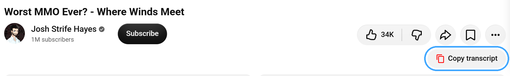
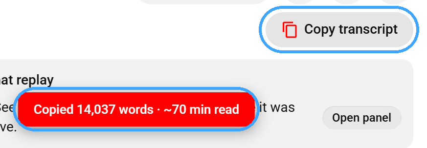
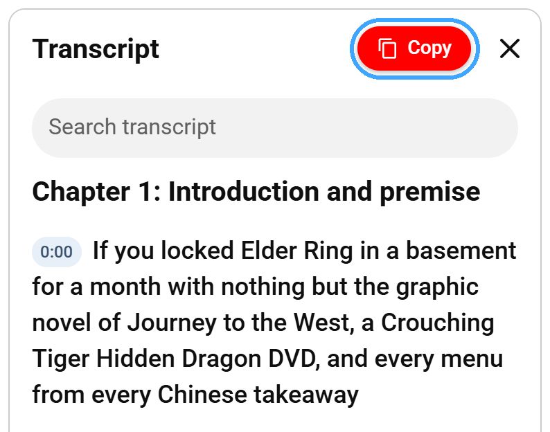
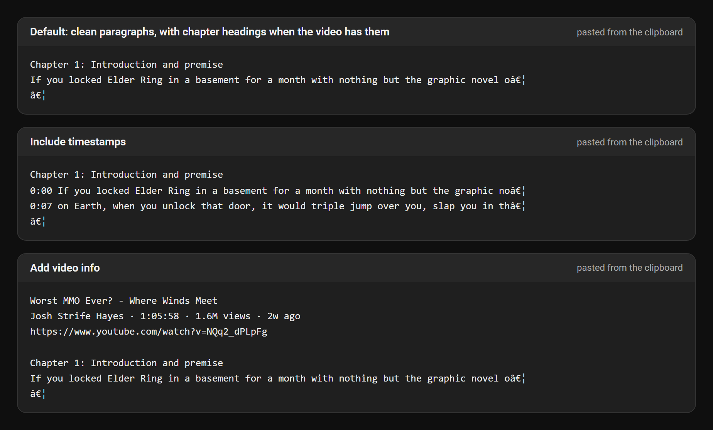
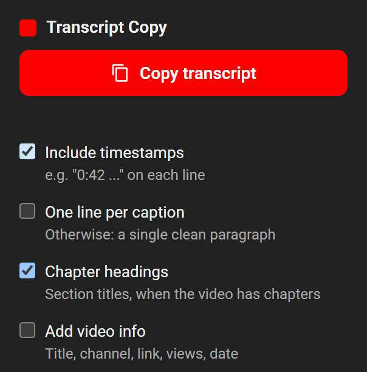

# YouTube Transcript Copy

Copy a YouTube video's full transcript in one click. A **Copy transcript**
button sits under every video, next to YouTube's own Like and Share buttons.
Click it and the extension opens the transcript for you, copies all of it, and
tells you how much it copied.

Built for pasting transcripts into ChatGPT, Claude, Gemini or your notes for
summaries, title ideas and show notes, without the select-all, scroll and drag
routine.



## Features

- **One click, no setup.** The button under the video opens the transcript
  itself. You never have to find "Show transcript".
- **Four ways to copy:** the button under the video, a **Copy** button in the
  transcript panel, the toolbar popup, or a keyboard shortcut (Alt+Shift+C by
  default).
- **Formats for your workflow:** clean paragraphs (default), one line per
  caption, or timestamps on every line.
- **Chapter headings:** when a video has chapters, their titles are copied as
  section headings, which gives an AI useful structure.
- **Video info header** (optional): title, channel, duration, views, upload
  date and link.
- **Tells you what it copied:** word count and an estimated reading time.
- **100% local:** no network requests, no analytics, no tracking.
- Works with both of YouTube's current transcript layouts, in light and dark
  themes.

## Screenshots

Taken with the extension installed, on Josh Strife Hayes' video
*Worst MMO Ever? - Where Winds Meet*.

**One click.** The button opens the transcript itself, copies everything, and
reports the result:



**In the transcript panel.** If you already have the transcript open, the red
Copy button sits next to the close button:



**What lands on your clipboard,** in each format (first lines shown):



**Settings** live in the toolbar popup:



## Install

The Chrome Web Store listing is on its way. Until then, install it manually.
This takes about a minute and works in Chrome, Edge, Brave, Opera and other
Chromium browsers.

### From a release (recommended)

1. Download the latest `youtube-transcript-copy-v*.zip` from the
   [Releases page](https://github.com/visavv/youtube-transcript-copy/releases/latest).
2. Unzip it into a folder you will keep. The browser loads the extension from
   that folder, so do not delete or move it afterwards.
3. Open `chrome://extensions` (Edge: `edge://extensions`, Brave:
   `brave://extensions`).
4. Turn on **Developer mode** (top right).
5. Click **Load unpacked** and select the unzipped folder (the one that
   contains `manifest.json`).
6. Optional: click the puzzle icon in the toolbar and pin
   **YouTube Transcript Copy** for quick access to its settings.

### From source

```bash
git clone https://github.com/visavv/youtube-transcript-copy.git
```

Then follow steps 3 to 6 above and select the cloned folder.

### Check the keyboard shortcut

The browser assigns Alt+Shift+C automatically unless another extension already
uses it. Open `chrome://extensions/shortcuts` to confirm it or pick another
combination. The popup always shows the shortcut that is currently assigned.

### Updating

Download the new release and replace the folder contents (or `git pull`), then
click the reload icon on the extension's card in `chrome://extensions`. Open
YouTube tabs keep working: the extension re-attaches itself the next time you
copy.

## Usage

1. Open any YouTube video that has captions (most do, including auto-generated
   ones).
2. Click **Copy transcript** under the video, or press Alt+Shift+C.
3. Paste anywhere.

A red notice confirms the copy, for example "Copied 14,037 words, ~70 min
read". If a video has no transcript, it says so instead.

## Settings

Open the toolbar popup to change the output format. Settings sync through your
browser profile.

| Setting | Effect |
|---|---|
| Include timestamps | Each caption on its own line, prefixed with its time, e.g. `0:42 ...` |
| One line per caption | Each caption on its own line, without times |
| Chapter headings (on) | Chapter titles as section headings, when the video has chapters |
| Add video info | Title, channel, duration, views, date and link above the transcript |

With every option off, you get one clean paragraph per chapter (or a single
paragraph if the video has no chapters). Word counts include caption text
only, not timestamps, headings or video info. Reading time assumes 200 words
per minute.

## Privacy and permissions

The extension runs entirely in your browser. It makes no network requests,
contains no analytics, and never collects, stores or sends your data. The
transcript goes to your clipboard only when you ask. The only stored data are
your four format settings.

| Permission | Why |
|---|---|
| `youtube.com` access | Adds the buttons and reads the transcript that YouTube already shows on the page |
| `clipboardWrite` | Puts the transcript on your clipboard |
| `storage` | Remembers your format settings |
| `activeTab`, `scripting` | Lets the popup and shortcut reach a YouTube tab that was open before the extension was installed or updated |

## Limitations

- Copies the captions YouTube has loaded in the transcript panel. If you typed
  in the panel's search box, clear it first, because it filters the list (the
  extension warns you when a filter is active).
- Works on regular `youtube.com/watch` pages. Shorts and embedded players are
  not supported yet.
- The video info dates and view counts are best parsed when YouTube is shown
  in English.
- YouTube changes its page structure from time to time. If the buttons stop
  appearing, please open an issue.

## Development

There is no build step. Load the folder unpacked and edit in place, then
reload the extension on `chrome://extensions` and refresh the YouTube tab.

| Path | Purpose |
|---|---|
| `manifest.json` | Extension manifest (Manifest V3) |
| `content.js` / `content.css` | Finds the transcript, adds the buttons, builds the copied text |
| `background.js` | Routes the keyboard shortcut to the active tab |
| `shared.js` | Popup and shortcut messaging, with on-demand script injection |
| `popup.html` / `popup.js` | Settings popup and one-click copy |
| `icons/` | Toolbar icons (`make_icons.py` regenerates them with plain Python) |
| `tests/` | Browser regression fixture that runs the real `content.js` |
| `scripts/package.py` | Builds the installable zip into `dist/` |

### Tests

The fixture runs `content.js` against static markup modelled on YouTube's
watch page, with the browser extension and clipboard APIs stubbed. It covers
both caption layouts, all output formats, chapters, stats, duplicate panels,
delayed loading, concurrent requests, navigation, missing transcripts,
clipboard focus handling, search-filter detection, re-injection and header
placement.

Headless, with [Node.js](https://nodejs.org) and Playwright for Python:

```bash
pip install playwright
python -m playwright install chromium
python tests/run_fixture.py
```

Or in your own browser: run `node tests/serve.cjs` and open
`http://127.0.0.1:8765/watch?v=fixture`.

The fixture does not replace a quick manual check on YouTube itself.

### Packaging

```bash
python scripts/package.py
```

This writes `dist/youtube-transcript-copy-v<version>.zip`, the file to upload
to the Chrome Web Store and attach to a GitHub release.

## Contributing

Issues and pull requests are welcome. Please run the fixture before sending
changes, and add a check to `tests/fixture.js` when you fix a bug.

## License

[MIT](LICENSE)

Not affiliated with YouTube or Google. Screenshots show a public YouTube video
to demonstrate the extension; the video and its captions belong to their
creator.
